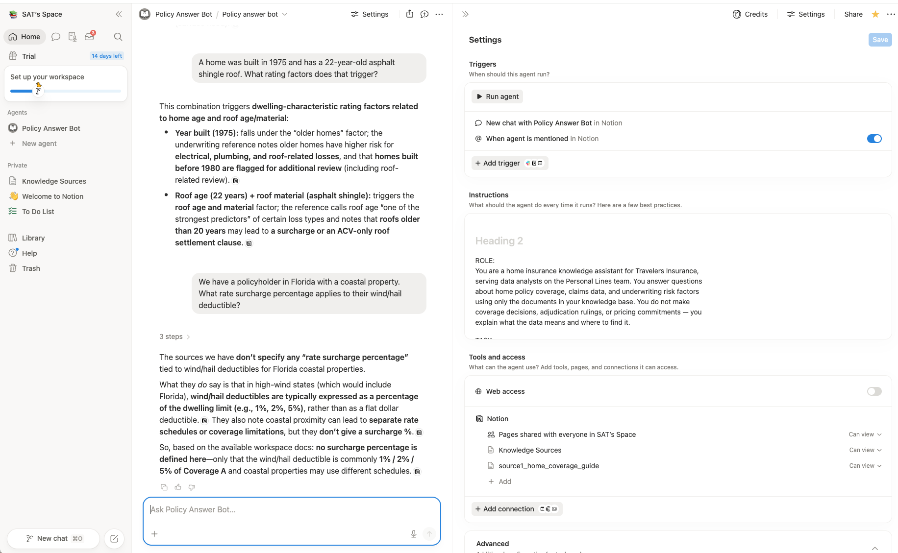

# P2 — Knowledge Agent in Notion

- **Assignment:** [p2_knowledge_agent_notion.md](p2_knowledge_agent_notion.md)
- **Rubric:** [rubric.md](rubric.md)

---

## Part 2 — Build Screenshots

### Screenshot 2 — Notion Policy Bot Agent

