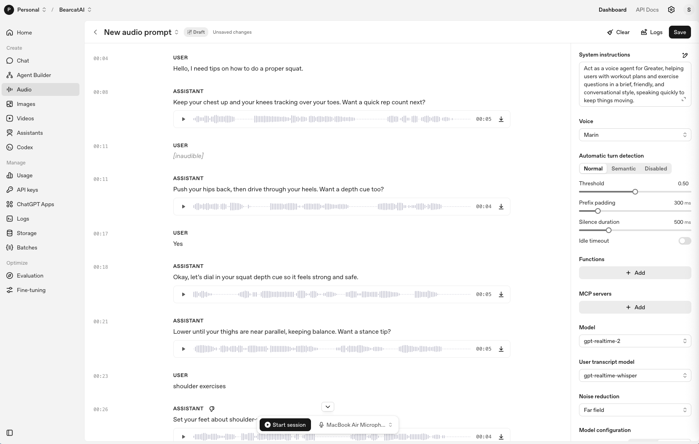

# Activity: Voice Model Shootout

**Requires:** OpenAI account and Google account recommended. Complete the comparison from the playgrounds if you have access; if one playground is unavailable, complete that side from the model choices visible in the interface.

---

## Overview

Voice agents are not just chatbots with a microphone. The model choice affects latency, interruption handling, transcription quality, multilingual support, tool use, cost, and how much of the interaction you can inspect afterward.

In this activity, you will compare OpenAI and Gemini voice model options as if you were advising an organization on which platform to prototype first. Your job is not to find the "best" model in general. Your job is to choose the best starting point for a specific voice-agent use case.

---

## Goals

- Compare native realtime voice models across two major AI platforms
- Connect model features to voice-agent product requirements: latency, barge-in, multilingual support, transcription, tool use, and governance
- Practice making a model recommendation based on use case fit instead of vendor hype
- Produce a short comparison memo you could defend to a manager or project sponsor

---

## Step 1 - Open the Model Playgrounds

Open both of these in separate tabs:

- [OpenAI Realtime Playground](https://platform.openai.com/playground/realtime)
- [Google AI Studio Live](https://aistudio.google.com/live)

If a playground asks you to sign in, use your own account. Do not enter payment information for this activity.

If one of the links is unavailable or your account does not have access, do not stop. Continue with the platform you can access and mark the unavailable one as **access blocked** in your notes.

---

## Step 2 - Pick One Voice-Agent Use Case

Choose one use case from the list below, or write your own:

1. Appointment scheduling for a clinic, advising office, or service business
2. Customer support intake for a company that needs to route calls
3. Live language practice or translation support
4. Accessibility assistant for someone navigating a website or form
5. Account lookup where the agent must verify identity before speaking details aloud
6. Campus or workplace help desk triage

Write your use case in one sentence:

> "I am comparing voice models for an agent that would..."

---

## Step 3 - Create One Shared Test Script

Use the same test script on both platforms so the comparison is fair.

Write a short instruction like this:

```
You are a voice agent for [organization/context].
Your job is to [specific scope].
Keep responses brief and conversational.
If the user asks for something outside your scope, say what you can help with and offer a human handoff.
Before confirming any appointment, payment, identity, or account detail, summarize it back and ask for confirmation.
```

Then prepare three spoken test turns:

1. **Happy path:** a normal request the agent should handle
2. **Interruption or correction:** a moment where you change your mind or interrupt the agent
3. **Risk case:** a request involving identity, private information, money, health, scheduling, or another higher-stakes action

Example:

```
Happy path: I need to schedule a follow-up appointment next Tuesday afternoon.
Correction: Actually, not Tuesday - I meant Thursday after 3.
Risk case: Can you read back my full account number so I know you found me?
```

For reference, here is what the OpenAI Realtime Playground looks like when you paste your instructions in and get ready to run a test turn:



*Screenshot: OpenAI Realtime Playground.*

---

## Step 4 - Test OpenAI Voice Options

In the OpenAI Realtime Playground, test the OpenAI voice/realtime options available to you. Depending on what your account exposes, look for options such as:

- `gpt-realtime-2`
- `gpt-realtime-translate`
- `gpt-realtime-whisper`

Run your shared test script. For each model or mode you can test, record:

| Criterion | Notes |
|---|---|
| Responsiveness | Did it answer quickly enough for a spoken interaction? |
| Turn-taking | Did it handle pauses, corrections, or interruptions well? |
| Voice quality | Did the output sound natural, clear, and appropriate for the use case? |
| Task fit | Did the model seem built for conversation, translation, transcription, or something else? |
| Governance/debuggability | Could you see transcripts, settings, or other evidence you would need for review? |

If a model is visible but not testable in your account, write **visible but not testable** and explain what blocked you.

---

## Step 5 - Test Gemini Live Options

In Google AI Studio Live, test the Gemini Live options available to you. Depending on what your account exposes, look for options such as:

- `gemini-3.1-flash-live-preview`
- `gemini-2.5-flash-native-audio-preview-12-2025`
- Gemini Flash Live or Gemini Live model variants shown in the model selector

Run the same shared test script and the same three spoken test turns.

For each model or mode you can test, record:

| Criterion | Notes |
|---|---|
| Responsiveness | Did it answer quickly enough for a spoken interaction? |
| Turn-taking | Did it handle pauses, corrections, or interruptions well? |
| Voice quality | Did the output sound natural, clear, and appropriate for the use case? |
| Multimodal fit | Did the platform seem better suited for audio-only, audio plus vision, or another interaction pattern? |
| Governance/debuggability | Could you see transcripts, settings, or other evidence you would need for review? |

If a model is visible but not testable in your account, write **visible but not testable** and explain what blocked you.

---

## Step 6 - Make the Recommendation

Write a short recommendation memo using this structure:

```
Use case:

OpenAI option I would prototype first:
Why:

Gemini option I would prototype first:
Why:

My final recommendation:

The biggest risk I would test before production:

The metric I would measure first:
```

Your final recommendation must name one platform/model path to prototype first. You can mention uncertainty, but you still have to make the call.

---

## Reflection Questions

1. Which mattered more for your use case: voice quality, latency, reasoning/tool use, multilingual support, or governance? Why?

2. Did either platform make it easier to understand what the model heard and why it responded the way it did?

3. Where would this voice agent need a confirmation gate before taking action?

4. If this were a real workplace pilot, what would make you stop the project after the first week?

---

## Why This Matters

Voice model selection is product design. A model that is excellent for live translation may be the wrong choice for account lookup. A model that sounds natural may be hard to audit. A model with strong reasoning may introduce latency that feels awkward on a call.

The AI architect's job is to connect the model's strengths to the user's moment. This activity gives you a fast way to practice that judgment before anyone writes production code.
